# Introduction

Markopolis is a web app and API server designed to serve Markdown files.

* Allows you to share Markdown notes as websites and interact with and manipulate your Markdown files using an API.

* Run a CLI in your local workstation and point it to a directory holding all your Markdown files and images, and the library takes care of everything else.

## Why Markopolis?

1. Currently, there is no centralised method for aggregating and displaying markdown files from GitHub, GitLab and local projects. This results in a document sprawl and it becomes unwieldy and inefficient to manage playbooks, runbooks, and other documents.

2. Markopolis provides an automated way to publish and share markdown notes as a web site, which could be a self-hosted site that allows public access through Cloudflare reverse proxy and SSO only, hence providing additional safeguards for sensitive notes.

3. A `git-sync` tool can be used to automate retrieval of a `wiki` from any GitHub or GitLab project.

4. A `pyinfra` CLI can be used to manage directories and files while ensuring idempotency in your local workstation.

5. A `python-frontmatter` library can be used to ensure that a frontmatter exists with the `publish` attribute in each markdown file.

6. A Markopolis tool `consume` can be used to publish a folder holding all your Markdown files and images, including all subfolders, to a Markopolis API endpoint.

## Proof-of-Concept

```mermaid
%%{ init: { 'theme': 'dark' } }%%
gantt
  title Proof-of-Concept
  dateFormat x
  axisFormat %L

  section 01.pyinfra
  files.template                      : crit, a1, 0, 200ms
  create git-sync config files        : a2, 0, 200ms

  section git-sync
  docker run                          : crit, b1, after a1, 200ms
  sync github                         : b2, after a1, 100ms
  sync gitlab                         : b3, after b2, 100ms

  section 02.pyinfra
  sync wiki with api                  : crit, after b3, 200ms
  files.directory                     : c1, after b3, 100ms
  files.sync                          : c2, after c1, 100ms

  section 03.frontmatter
  frontmatter.load                    : crit, after c2, 120ms
  publish=true                        : d1, after c2, 120ms

  section Markopolis API
  publish                             : crit, after d1, 200ms
  04.pyinfra                          : e1, after d1, 100ms
  make consume                        : e2, after e1, 100ms
```

